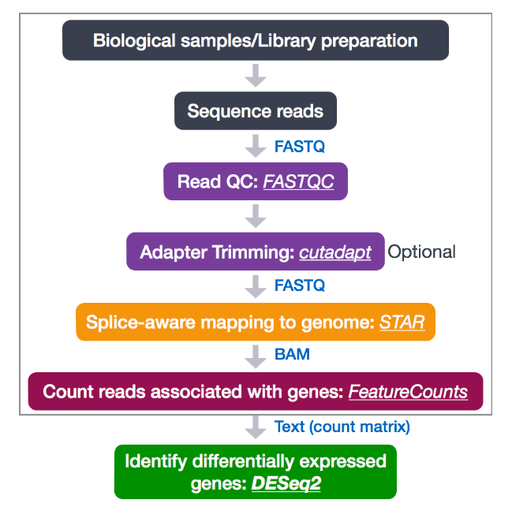
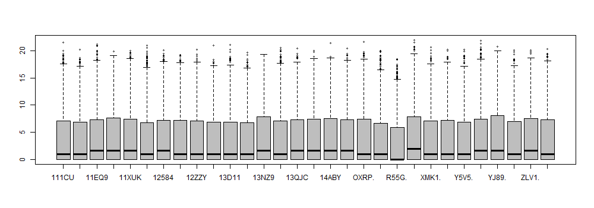
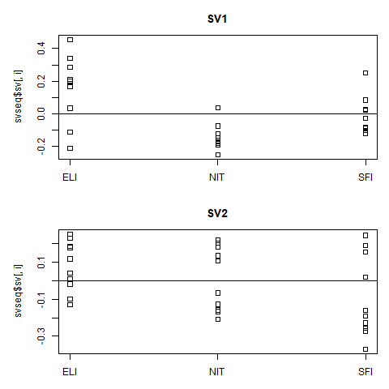

```{r setup, include=FALSE}
knitr::opts_chunk$set(echo = TRUE)
```

## PEC2: Análisis de datos Ómicos. Análisis de datos de RNAseq
# Estudiante: Silvia Garcia Lezcano

Repositorio en GitHub: https://github.com/silviatgl/PEC2_SILVIA_GARCIA.git

# Objetivos: 

El objetivo de esta PEC es demostrar las habilidades adquiridas durante la asignatura en el análisis de datos de RNA seq. Para ello vamos a analizar los datos de RNASeq de 10 muestras en 10 condiciones distintas para ver si el nivel de infiltramiento de distintos tejidos ver si hay una diferencia a nivel de expresión de RNA. 

# Métodos

En un ambito normal partiríamos de "base call files" que es el archivo más crudo de un secuenciador. Primero haríamos el demultiplexado para obtener los FastQs de cada una de las muestras usando un software como bcl2fastQ. Lo siguiente que habría que hacer sería alinear las lecturas contra el genoma de referencia, eliminar los duplicados de PCR y duplicados ópticos. Esto dependería mucho del método utilizado para preparar las librerías de RNA y de la máquina usada.Una vez realizado el alineamiento y este filtrado de calidad inicial, obtendríamos los archivos bam. En la figura 1 resumimos el proceso de análisis de datos que tenemos que hacer antes de empezar con el análisis mostrado en este análisis. Una vez tuvieramos los bam y los datos de las muestras, podríamos comenzar a analizar los datos con el paquete DESeq2. En el caso específico de este análisis empezamos directamente con un archivo de conteo, que se generaría a partir de los bams, básicamente contando cuantas copias únicas de cada tránscrito se han secuenciado en una carrera, más un archivo en el cual tenemos un resumen de las muestras y sus condiciones de análisis




# Selección de los datos y carga de los datos: 

Primero cargamos ambos csv, tenemos que tener cuidado al ver como están organizados. Después hacemos una selección aleatoria de 10 valores de cada uno de los grupos del archivo targets: 

```{r}
library(dplyr)
counts <- read.table("~/Silvia/Omicas/archivos targets y counts/counts.csv", row.names = 1, sep = ";", header = TRUE, check.names = FALSE)
targets <- read.csv("~/Silvia/Omicas/archivos targets y counts/targets.csv")
#eliminamos las dos primeras columnas que no tienen utilidad
targets <- targets [,-2]
#filtramos 10 muestras aleatorias para cada grupo
targets10 <- targets %>% filter(Group %in% c("NIT", "ELI", "SFI")) %>% group_by(Group) %>% sample_n(., 10)
```

El siguiente paso es seleccionar las columnas correspondientes en el archivo "counts.csv", pero esto no nimio,ya que tenemos que asegurarnos de que tenemos el data frame importado de la manera correcta, para poder filtrarlo sin que se corte la primera columna, tenemos que incluirla como `rownames`. Despues podemos proceder a realizar la intersección de los datos.

```{r}
counts10<- counts[intersect(names(counts), targets10$Sample_Name)]
library(knitr)
kable(head(counts10))

```

¡Hay que tener en cuenta que las muestras no están en el mismo orden con respecto al archivo de targets! Esto ha generado un primer análisis que no tenía sentido y hemos tenido que repetir todo el proceso hasta que hemos entendido que este era el problema gracias al training de DESeq2 de Bioconductor(Love,2020).

Es absolutamente crítico que las columnas de la matriz de conteo y las filas de los datos de la columna (información sobre muestras) estén en el mismo orden. DESeq2 no hará conjeturas sobre qué columna de la matriz de conteo pertenece a qué fila de los datos de la columna, estos deben proporcionarse a DESeq2 ya en un orden consistente.Por tanto debemos organizar las muestras en el archivo counts en el mismo orden que aparecen en el de targets: 

```{r}
#Primero les cambiamos el nombre para trabajar con mayor comodidad: 
coldata<-targets10
countdata<-counts10

# luego usamos la librería data.table para ordenar nuestras columnas del archivo de counts en el orden de la columna de Sample_Name

library(data.table)
setcolorder(countdata, as.character(coldata$Sample_Name))

#Eliminamos el ".X" de los nombres de ENSEMBL para evitar problemas a la hora de anotar los tránscritos: 

rownames(countdata) <- sub("\\.\\d$","",rownames(countdata))
```

Ahora ya tendríamos los datos listos para empezar a trabajar con ellos      

# Control de calidad

Los datos crudos deben ser revisados para poder tener una visión general de que estamos trabajando con datos de calidad y poder ver si hay algun problema que deba ser afrontado antes de empezar con el análisis. Para ello podemos crear una DGElist y realizar un histograma del archivo `counts`, como esté en si mismo no da mucha información, podemos conbinarlo con el histograma de los datos sobre log2.

```{r, message=FALSE} 
library(edgeR)
d<- DGEList(counts10, group = targets10$Group, genes = rownames(counts10)); class(d)
d<- DGEList(counts10, group = targets10$Group, genes = rownames(counts10)); class(d)
par(mfrow=c(2,1))
hist(d$counts, xlab = "Counts", main="Histograma de los counts", col="pink")
hist(log2(d$counts + 1),  breaks=100, xlab = "log2(Counts+1)", main="Histograma log2(Counts+1)", col="pink")
```

*Figura 2: Histograms de los números de lecturas asociadas a cada tránscrito.* 


Hay un gran número de tránscritos con ninguna lectura, como no sabemos de que tipo de experimento es podemos asumir que son datos de secuenciacion del transcriptoma completo y no un panel de enriquecimiento de solo algunos genes según el interés del estudio. Por tanto, tiene mucho sentido pensar que haya una gran cantidad de genes sin ningún tipo de lecturas, ya que no se están expresando en dicho tejido. Pero también podemos proceder a estudiarlos mediante un diagrama de cajas 

`
boxplot(log2(d$counts + 1), cex=.5, names= substr(rownames(d$samples), 6, 10), col="grey")
`



Ahora podemos explorar los *log-expression* de las muestras con gráficos MA
 
```{r}

par(mfrow=c(2,2))
 for (i in 1:8){
     plotMD(cpm(d, log=TRUE), column=i)
   abline(h=0, col="red", lty=2, lwd=2)}

```
*Figura 4: gráficos MD de los counts crudos por muestra*

Aunque si que tienen un poco de ruido, los datos se ajustan bastante a la media, por lo que los podemos considerar buenos para continuar. 


# DESeq Data Set y Filfrado de los datos

Ahora vamos a crear un `DESeqDataSet`para poder continuar con nuestro análisis, en este caso empezamos desde una matriz de conteo y una tabla de `targets`. Tenemos que pensar en este punto cual es nuestro diseño experimental y cuantas condiciones deberán formar parte de nuestro diseño. En este caso tenemos tres grupos de muestras que deberán ser tratadas de manera independiente y ser comparadas entre ellas. Por tanto nuestro diseño tendrá un único valor en el valor del diseño. 

```{r, message=FALSE}
library(DESeq2)

dds<- DESeqDataSetFromMatrix(countData = countdata, colData = coldata, design = ~ Group)
dds
```

Una vez creada nuestra base de datos debemos filtrar todos aquellos valores que no tienen counts asociados, que no nos interesan. Esto permitirá hacer nuestro análisis un poco más rápido y eficiente. Empezamos eliminando todos aquellos genes para los cuales haya 0 o 1 lectura

```{r}
nrow(dds)
ddsF<- dds [rowSums(counts(dds))>1]
nrow(dds)
```
Como vemos que no cambia el núnero de líneas podemos considerar que este filtrado no era necesario 

# Transformación de los datos para estabilizar la varianza 

Muchos métodos estadísticos comunes para el análisis exploratorio de datos multidimensionales funcionan mejor para los datos que generalmente tienen el mismo rango de varianza. Cuando la cantidad esperada de varianza es aproximadamente la misma en diferentes valores medios, se dice que los datos son "homoskedastic". Sin embargo, para los recuentos de RNA-seq, la varianza esperada crece con la media. DESeq2 ofrece dos transformaciones para los datos de conteo que estabilizan la varianza a través de la media: para datos binomiales negativos con una tendencia de dispersión media (Anders y Huber 2010), implementada en la función vst, y (Love, Huber y Anders 2014). Para genes con recuentos altos, tanto el VST como el rlog darán un resultado similar a la transformación ordinaria log2 de los recuentos normalizados.

Los análisis de VST son mucho más rápidos y son los recomendados para datasets grandes con una N mayor a 30. Mientras que para estudios menores se recomienda la transformacion de log2. Como aquí nos hayamos en una situación en la cual estamos en el límite podemos probar ambas aproximaciones. 

```{r, echo=FALSE}
#por rlog 

rld<-rlog(dds, blind=FALSE)

```

```{r}
#por VST

vsd <- vst(dds, blind = FALSE)
head(assay(vsd),3)

```

Especificamos `blind = FALSE`, lo que significa que las diferencias entre los grupos (la variable en el diseño) no contribuirán a la tendencia esperada de varianza media del experimento. El diseño experimental no se usa directamente en la transformación, solo para estimar la cantidad global de variabilidad en los recuentos.Por un tema de capacidad de computación se va a usar únicamente el análisis vst de aquí en adelante. 

# Distancias de las muestras

Para ver como de similares son nuestras expresiones de genes entre nuestras muestras, lo primero que debemos hacer es calcular las distancias entre las expresiones de los distintos tránscritos, esto nos permitirá obtener una lista ordenada de los transcritos que tienen counts en comun entre unas y otras muestras. Para ver las distancias de una manera visual, vamos a realizar un gráfico de mapa de color sobre nuestras distancias: 

```{r}
sDist<- dist(t(assay(vsd)))
sDistmatrix<- as.matrix(sDist)
knitr::kable(head(sDistmatrix))
```

```{r}
library(pheatmap)
library(RColorBrewer)
rownames(sDistmatrix) <- paste( vsd$dex, vsd$cell, sep = " - " )
colnames(sDistmatrix) <- NULL
colors <- colorRampPalette( rev(brewer.pal(9, "Purples")) )(255)
pheatmap(sDistmatrix, clustering_distance_rows = sDist, clustering_distance_cols = sDist,col = colors)
```

*Figura 5: Distancias entre el número de tránscritos compartido por cada una de las muestras* 

# Gráfico de análisis de componentes principales y de escalado multidimensional

Podemos hacer un análisis de componentes principales y plotearlo, dandole un color distinto a cada uno de los grupos, de menera que poodemos ver como se agrupan en función de los dos componentes principales. Vemos que la primera componente explica un 61% de la varianza, pero los datos están muy esparcidos sobre el eje. La segunda variable solo exploca un 8% de la varianza y las muestras están divididas en dos grandes grupos. 

```{r, message= FALSE }
library(DESeq2)
plotPCA(vsd, intgroup = c("Group"))
```

*Figura 6: Análisis de componentes principales por grupos de análisis* 

El escalado multidimensional (MDS) es un medio para visualizar el nivel de similitud de casos individuales de un conjunto de datos. MDS se utiliza para traducir "información sobre las distancias por pares entre un conjunto de n objetos" en una configuración de n puntos mapeados en un espacio cartesiano abstracto.

Más técnicamente, MDS se refiere a un conjunto de técnicas de ordenación relacionadas utilizadas en la visualización de información, en particular para mostrar la información contenida en una matriz de distancia. Es una forma de reducción de dimensionalidad no lineal. Que aquí podemos usa para ver como se distribuyen los datos entre las distintas muestras. 

```{r, message=FALSE}
library("dplyr")
library("ggplot2")
mds <- as.data.frame(colData(vsd))  %>% cbind(cmdscale(sDistmatrix))
ggplot(mds, aes(x = `1`, y = `2`, color = Group,)) + geom_point(size = 3) + coord_fixed()

```

*Figura 7: Análisis de escalado multidimensional*

Vemos que las muestras si se agrupan por grupos por lo que podemos entender que tienen unos perfiles de expresión que están pueden ser comparados.  

# Análisis Diferencial de Expresión

A nuestro set de datos creado con `DESeqDataSeq` ya le hemos indicado que nuestras muestras se agrupan por grupos y que lo que queremos hacer es compararlas entre ellas. El paquete `DESeq` nos permite por tanto correr un análisis diferencial con un solo comando. 

los datos de conteo generados por RNA-seq exhiben sobredispersión (varianza> media) y la distribución estadística utilizada para modelar los conteos necesita dar cuenta de esta sobredispersión.

```{r, message=FALSE}
library(DESeq2)
ddsDE<- DESeq(dds)
```

El ajuste de modelos matemáticos es una manera de aproximar cómo se comportan los datos dado un conjunto de parámetros (es decir, factor de tamaño, dispersión). DESeq2 usará su fórmula como nuestro modelo para cada gen, y ajustará los datos de conteo normalizados. Después de que el modelo se ajuste, se calculan los coeficientes para cada grupo de muestras junto con su error estándar.

Nos devuelve un DESeqDataSet que contiene todos los parámetros ajustado, ahora vamos aextraer tablas de resultados de interés de este objeto. Debido a que Group`` es la única variable que estamos usando para hacer la comparativa de tres grupos distintos entre ellos. Es decir, nos interesa ver como se comparan los tres grupos de tejidos, los no inflitrados versus los que tienen pequeñas infiltraciones locales, y ambos dos contra los que están altamente infiltrados. Para ello podemos usar el comando de resultados de DESeq2:

```{r}
library(DESeq2)
#Primero comparamos ELI vs NIT
resEvN<- results(ddsDE, contrast = c("Group", "ELI", "NIT"))
knitr::kable(head(resEvN))

# Después ELI vs SFI
resEvS<- results(ddsDE, contrast = c("Group", "ELI", "SFI"))
knitr::kable(head(resEvS))


#Por último, SFI vs NIT
resSvN<- results(ddsDE, contrast = c("Group", "SFI", "NIT"))
knitr::kable(head(resSvN))

```

Ahora debemos darle significado a estas comparaciones. Primero deberíamos decidir que cual es el ratio de falsos postivos que vamos a considerar aceptables. Para ello vamos primero a ver un resumen de las tres comparativas:

```{r}

summary(resEvN) 
summary(resEvS)
summary(resSvN)

```

Una gráfica que puede ser útil para explorar nuestros resultados es la gráfica MA. El gráfico MA muestra la media de los recuentos normalizados frente a los cambios de log2 para todos los genes probados. Los genes que son significativamente DE están coloreados para ser fácilmente identificados. Esta también es una excelente manera de ilustrar el efecto de la contracción de LFC. El paquete DESeq2 ofrece una función simple para generar un diagrama MA.

```{r}
library(DESeq2)
par(mfrow=c(1,3))
plotMA(resEvN)
plotMA(resEvS)
plotMA(resSvN)
```

*Figura 7: Distribución del fold change de las distintas comparativas, Siendo la primera imagen ELI vs NIT, la segunda, ELI vs SIF y la última SIF vs ELI*

Los tránscritos que tienen un valor de padj significativo aparecen en rojo, vemos que son un número elevado sobretodo cuando se compara los tejidos con mucha infiltración (ELI), con los que no están infiltrados (NIT)

Vamos a considerar que aceptamos un 5% de falsos positivos como aceptable. Por tanto podemos considerar todos los genes que sean considerados como significativos si tienen un p value ajustado por debajo de 0.05. Primero vamos a ver cuantos genes tenemos que cumplen estas condiciones para cada comparativa: 

```{r}

sum(resEvN$padj < 0.05, na.rm = TRUE)
sum(resEvS$padj < 0.05, na.rm = TRUE)
sum(resSvN$padj < 0.05, na.rm = TRUE)

```


Bien, vemos que tenemos un número aceptable de genes que cumplen esta restricción, por lo que ahora podemos reducir nuestra lista a únicamente aquellos tránscritos que sean significativos a un padj < 0.05

````{r}

sub_resEvN<- subset(resEvN, padj < 0.05)

sub_resEvS<- subset(resEvS, padj < 0.05)

sub_resSvN<- subset(resSvN, padj < 0.05)

head(sub_resEvN[order(sub_resEvN$log2FoldChange), ])
```

y para verlos en orden de más a menos expresados;

```{r}
head(sub_resEvN[ order(sub_resEvN$log2FoldChange, decreasing = TRUE),  ])
```


# Visualización de los resultados

Una forma rápida de visualizar los recuentos de un gen en particular es usar la función plotCounts que toma como argumentos el DESeqDataSet

```{r, message=FALSE}
topGene1 <- rownames(resEvN)[which.min(resEvN$padj)]
topGene2 <- rownames(resSvN)[which.min(resSvN$padj)]
topgene3<-rownames(resEvS)[which.min(resEvS$padj)]
library(ggbeeswarm)

geneCounts1 <- plotCounts(ddsDE, gene = topGene1, intgroup = c("Group"), returnData = TRUE)
geneCounts2 <- plotCounts(ddsDE, gene = topGene2, intgroup = c("Group"), returnData = TRUE)
geneCounts3 <- plotCounts(ddsDE, gene = topgene3, intgroup = c("Group"), returnData = TRUE)

par(mfrow=c(1,3))
ggplot(geneCounts1, aes(x = Group, y = count, color = Group, group = Group)) +
    scale_y_log10() + geom_point(size = 3) + geom_line()

ggplot(geneCounts2, aes(x = Group, y = count, color = Group, group = Group)) +
    scale_y_log10() + geom_point(size = 3) + geom_line()
ggplot(geneCounts3, aes(x = Group, y = count, color = Group, group = Group)) +
    scale_y_log10() + geom_point(size = 3) + geom_line()

```

*Figura 9:Gene Counts para tres tránscritos distintos en las distintas comparativas: 1)ENSG00000167483, 2)ENSG00000211598 u 3)ENSG00000167483*


Otra manera de ver cuanto varían los niveles de expresión de los genes es mediante un clustering de genes, en este caso al ser demasiado hacerlo con todos, lo vamos ahacer con 20 genes con más varianza entre todas las muestras. Se trabaja con los datos obtenidos del VST. 

```{r}
library(DESeq2)
library(genefilter)
library(pheatmap)

top1<- head(order(rowVars(assay(vsd)), decreasing= TRUE), 20)
mat <- assay(vsd)[top1, ]
mat <- mat - rowMeans(mat)
anno<-as.data.frame(colData(vsd)[, c("Group")],col.name=c("Group"))
rownames(anno)<-colnames(mat)
par(mar=c(1,1,1,1))
pheatmap(mat, annotation_col = anno)

```

*Figura 10: mapa de color entre la expresión de los genes en las distintas muestras*

# Anotar y exportar los datos

Ahora hay que convertir estos datos en tránscritos en valores reales de genes que estén anotados en la base de datos del genoma humano. Vamos a usar el hg19 como en el ejemplo visto en clase. Lo vamos a hacer sobre los resultados ya filtrados, para un padj de 0.05, ya que no nos interesan el resto de resultados de aquí en adelante 

```{r}
library("AnnotationDbi")
library(org.Hs.eg.db)

#para darle las anotaciones de los tránscritos de ENSEMBL
sub_resEvN$symbol <- mapIds(org.Hs.eg.db,keys=row.names(sub_resEvN),column="SYMBOL",keytype="ENSEMBL",multiVals="first")

sub_resEvS$symbol <- mapIds(org.Hs.eg.db,keys=row.names(sub_resEvS),column="SYMBOL",keytype="ENSEMBL",multiVals="first")

sub_resSvN$symbol<-mapIds(org.Hs.eg.db,keys=row.names(sub_resSvN),column="SYMBOL",keytype="ENSEMBL",multiVals="first")

#para darles las anotaciones de los genes de ENTREZID

sub_resEvN$entrez <- mapIds(org.Hs.eg.db,keys=row.names(sub_resEvN),column="ENTREZID",keytype="ENSEMBL",multiVals="first")

sub_resEvS$entrez<-mapIds(org.Hs.eg.db,keys=row.names(sub_resEvS),column="ENTREZID",keytype="ENSEMBL",multiVals="first")

sub_resSvN$entrez <- mapIds(org.Hs.eg.db,keys=row.names(sub_resSvN),column="ENTREZID",keytype="ENSEMBL",multiVals="first")

```

Podemos comprobar que efectivamente tenemos los transcritos anotados:

```{r}
head(sub_resEvN)
```

Podemos ver que la anotación se ha realizado correctamente y que ahora tenemos dos nuevas columnas, una con el símbolo de ENSEMBL  y otra con el código de ENTREZID.Ahora podemos exportarlos en formato csv para poder revisarlos fuera del ambiente R. 

```{r, results=FALSE}
 write.csv(sub_resEvN,"C:/Users/slezcano/Documents/Silvia/Omicas/PEC2_T3/EliVsNit.csv")
write.csv(sub_resEvS,"C:/Users/slezcano/Documents/Silvia/Omicas/PEC2_T3/ElivsSfi.csv")
write.csv(sub_resSvN,"C:/Users/slezcano/Documents/Silvia/Omicas/PEC2_T3/SfiVsNIT.csv")

```

También podemos convertirlos en reports html de manera que podamos visualizarlos y filtrarlos de una manera más cómoda e interactiva (Huntley, 2013).Para ello podemos usar el paquete `ReportingTools`

```{r, results=FALSE}
library(ReportingTools)
EvNDF<-as.data.frame(sub_resEvN)
EvSDF<-as.data.frame(sub_resEvS)
SvNDF<-as.data.frame(sub_resSvN)

rep1<- HTMLReport(shortName = "rep1", title = "ELI vs NIT", reportDirectory = ".")
rep2<- HTMLReport(shortName = "rep2", title = "ELI vs SIF", reportDirectory = ".")
rep3<-HTMLReport(shortName = "rep3", title = "SIF vs NIT", reportDirectory = ".")

publish(EvNDF, rep1)
url<-finish(rep1)

publish(EvSDF, rep2)
url2<-finish(rep2)

publish(SvNDF, rep3)
url3<-finish(rep3)

```

Ahora podremos acceder a los archivos en formato HTML en el directorio de trabajo de los resultados. 

# Eliminar efectos de Batch:

Podemos por último revisar los datos y ver si tenemos algun efecto debido al batch que deba ser corregido o tenido en cuenta. Podemos usar métodos estadísticos diseñados para RNA-seq del paquete sva (Leek 2014)  en Bioconductor para detectar tales agrupaciones de muestras, y luego podemos agregarlas al diseño DESeqDataSet, para tenerlas en cuenta. 

El paquete sva contiene funciones para eliminar efectos por batch y otras variaciones no deseadas en experimentos de alto rendimiento como es el caso de RNAseq. Específicamente, el paquete sva contiene funciones para identificar y construir variables sustitutas para conjuntos de datos. Las variables sustitutas son covariables construidas directamente a partir de los datos que puede usarse en análisis posteriores para ajustar fuentes de ruido desconocidas.

Como conocemos los datos sabemos que se tienen que agrupar correctamente en tres grupos distintos, y podemos ver visualmente como se agrupan en función a dos variables surrogadas: 

```{r}
library(sva)
dat<-counts(ddsDE, normalize=TRUE)
idx  <- rowMeans(dat) > 1
dat  <- dat[idx, ]
mod  <- model.matrix(~ Group, colData(dds))
mod0 <- model.matrix(~   1, colData(dds))
svseq <- svaseq(dat, mod, mod0, n.sv = 2)
svseq$sv
```

Como realmente conocemos el grupo al que pertence cada muestra podemos hacer un gráfico para ver como ha conseguido el método SVA hacer el agrupamiento

```{r, results=FALSE}
png("png1.png")
par(mfrow = c(2, 1), mar=c(3,5,3,1))
 for (i in 1:2) {
     stripchart(svseq$sv[, i] ~ dds$Group, vertical = TRUE, main = paste0("SV", i))
     abline(h = 0)
 }
dev.off()
```



Si quisieramos controlar estos efectos de batch y eliminarlos, tendríamos simplemente que crear dos nuevas columnas en nuestro objeto DESeqDataSet y volver a realizar el análisis con este nuevo diseño. En este caso podemos ver que estos efectos están perfectamente explicados por las diferencias de infiltración de los tejidos, por lo que esto no sería necesario y se escapa al tiempo que poseemos para hacer este informe. Como hemos visto en clase, una aproximación similar se podría realizar también con otros cálculos, como el que nos facilita el paquete  RUVSeq  (Risso et al. 2014). 

RUV propone una estrategia de normalización, llamada "eliminar la variación no deseada" (RUV), que se ajusta a los efectos técnicos que pueden generar un problema mediante el análisis factorial en conjuntos  de genes de control (por ejemplo, spike-in de ERCC) o muestras replicadas. Su enfoque conduce a estimaciones más precisas de los cambios de expresión y pruebas de expresión diferencial en comparación otros  métodos de normalización. En particular, RUV se recomienda en grandes proyectos de colaboración que involucren múltiples laboratorios, técnicos y / o plataformas de secuenciación. Para normalizar toda esa variabilidad que se produce por puros efectos técnicos. 

# Conclusiones

En este trabajo hemos explorado una posible pipeline de análisis de datos de RNASeq, una vez obtenido los datos de los genes expresados de manera diferencial entre las tres condiciones con un p-valor ajustado menor o igual a 0.05 deberá luego ser interpretado, es decir, los biólogos y ciéntificos tendrán que evaluar cuales de los genes obtenidos en este estudio pueden tener un signficado biológico para explicar nuestra hipótesis. Para ello podrán utilizar nuestro output anotado, nuestros csv o reports html que les permitirán ver los genes afectados de una manera más senciall. 

En este ejemplo, este análisis serviría para, al ser interpretado, entender mejor a biología de los tejidos sin infiltración, con un poco de infiltración y con infiltración alta por parte de algún otro tipo de células que no son las del tiroides (no se especifica). Ver que genes están sobre expresados o inhibidos en los tejidos infiltrados versus los no infiltrados ayudaría a enteneder cual es el mecanismo por el cual se produce la infiltración en las células estudiadas. 

# Referencias

http://bioconductor.org/packages/devel/bioc/vignettes/DESeq2/inst/doc/DESeq2.html#standard-workflow

Love, M.I., Huber, W., Anders, S. (2014) Moderated estimation of fold change and dispersion for RNA-seq data with DESeq2. Genome Biology, 15:550. 10.1186/s13059-014-0550-8

Anders S, Huber W. Differential expression analysis for sequence count data. Genome Biol. 2010;11(10):R106. doi:10.1186/gb-2010-11-10-r106

Huntley MA, Larson JL, Chaivorapol C, Becker G, Lawrence M, Hackney JA, Kaminker JS (in press). “ReportingTools: an automated result processing and presentation toolkit for high throughput genomic analyses.” Bioinformatics. (2013)

Risso D, Ngai J, Speed T, Dudoit S (2014). “Normalization of RNA-seq data using factor analysis of control genes or samples.” Nature Biotechnology, 32(9), 896–902. 

Leek JT, Johnson WE, Parker HS, Fertig EJ, Jaffe AE, Zhang Y, Storey JD, Torres LC (2020). sva: Surrogate Variable Analysis